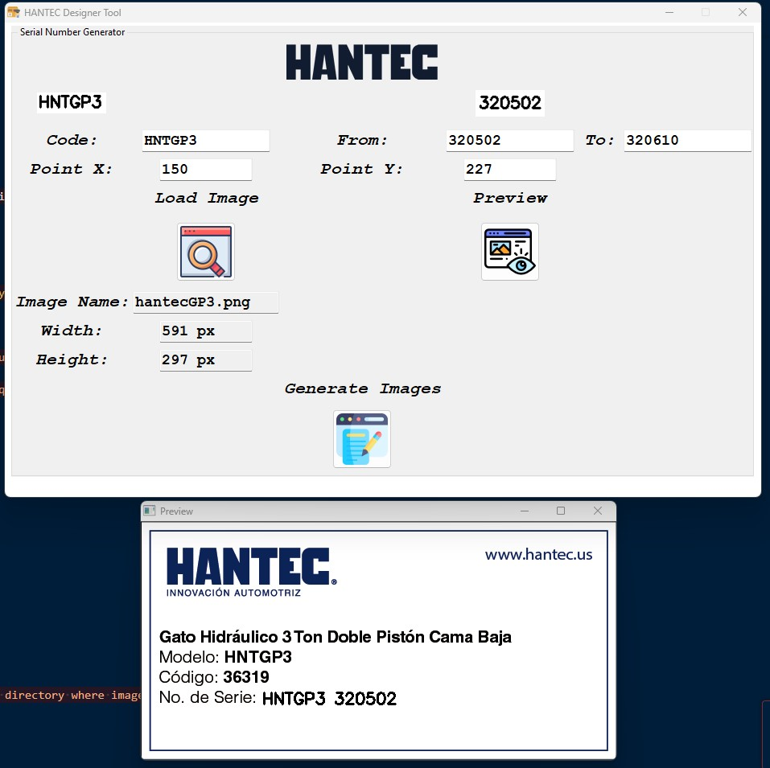
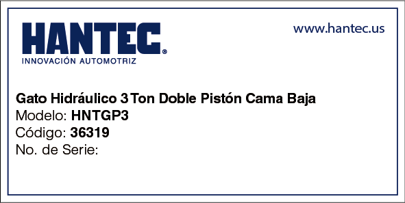
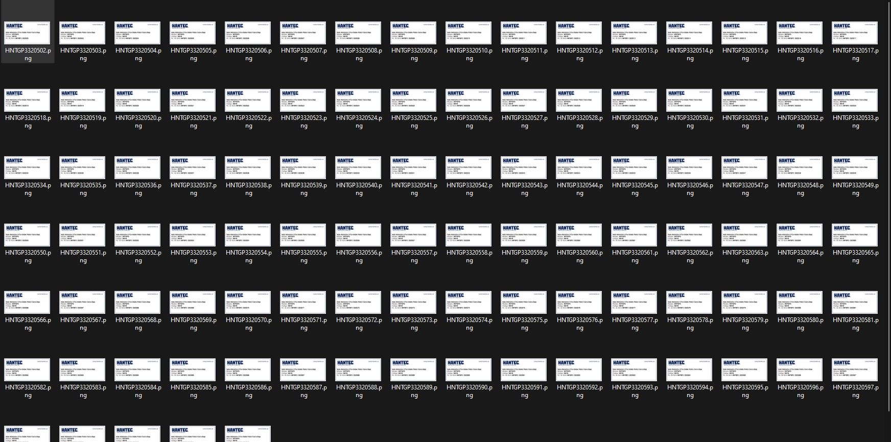

# 🧾 HANTEC Designer Tool — Generador Automático de Imágenes con SKUs

**HANTEC Designer Tool** es una aplicación de escritorio desarrollada en Python, pensada para **automatizar la generación masiva de imágenes** con códigos SKU (Stock Keeping Units), ideales para etiquetado de productos, inventario, control de producción, o branding visual.

Diseñada para agilizar procesos industriales o comerciales donde se requiere marcar productos con identificadores únicos sobre imágenes base.

---

## 🚀 Características principales

- Carga de imagen base del producto (formatos soportados: `.png`, `.jpg`, `.jpeg`, `.bmp`).
- Ingreso de:
  - Un **código SKU estático** (ej: `SKU-HANTEC-`).
  - Un **rango dinámico** (ej: del 1001 al 1050).
  - Coordenadas `X`, `Y` para colocar el texto SKU en la imagen.
- **Vista previa** instantánea de cómo se verá el SKU en la imagen.
- **Generación automática** de todas las imágenes con el código correspondiente.
- Guarda las imágenes en una carpeta organizada automáticamente.

---

## 🧩 Tecnologías utilizadas

- **Python 3**
- **Tkinter** – Interfaz gráfica.
- **OpenCV** – Manipulación de imágenes y escritura de texto.

---

🛠️ Uso paso a paso

Ejecuta la aplicación:

python hantec_designer.py

Haz clic en "Load Image" para seleccionar la imagen base del producto.

Ingresa los siguientes datos:

Código SKU Estático: Parte fija del identificador (ej: SKU-HANTEC-).

Desde - Hasta: Rango de numeración dinámica (ej: 1000 a 1020).

Punto X, Y: Coordenadas donde aparecerá el texto en la imagen.

Haz clic en "Preview" para verificar visualmente.

Haz clic en "Generate Images" para crear todas las imágenes con los SKUs.

Selecciona una carpeta de destino: se creará una subcarpeta imagesGenerated con todas las imágenes generadas.

🧠 Casos de uso

Fabricación industrial con SKU por lote.

Generación de etiquetas para productos empaquetados.

Visualización de identificadores únicos en presentaciones o catálogos.

⚠️ Validaciones incluidas

Verifica que todos los campos estén completos.

Confirma que las coordenadas y rangos sean numéricos válidos.

Solo permite imágenes con extensiones válidas.

Muestra errores claros si algo falla.

Imagen de referencia

Resultados

